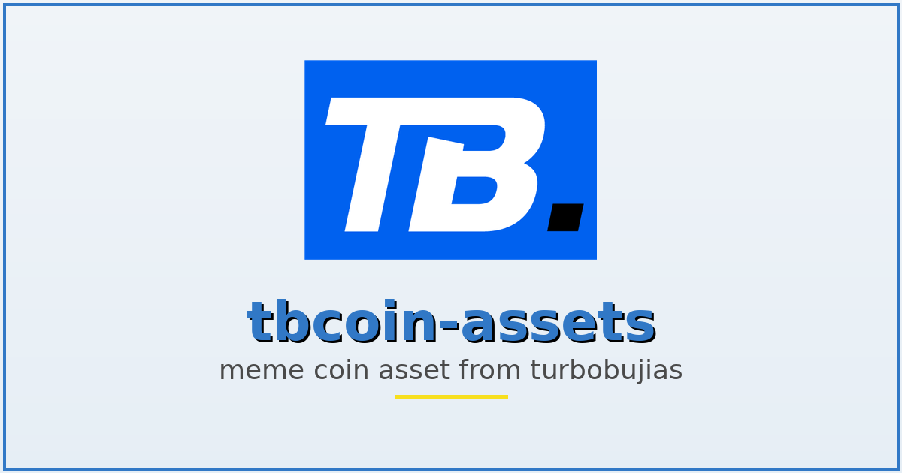

# 🧠 TB Coin: Quantum Meme Intelligence (QMI) — Backend README

TL;DR — This repository contains the backend assets and docs for TB Coin's Quantum Meme Intelligence (QMI) platform: a multi-service AI/ML + blockchain orchestration layer that detects viral memetics + market signals, forms consensus using multi-model AI, and optionally executes on-chain actions via Solana.

---

## Architecture Diagrams & Visuals

- Main social preview (root):
  

- Architecture diagram  (assets/images/architecture-diagram.png):
  

- Consensus flow / decision pipeline (assets/images/consensus-flow.png):
  

- Quantum decision matrix & reinforcement loop (assets/images/quantum-matrix.png):
  

- Economic token distribution (assets/images/economic-distribution.png):
  

(See /assets/images/ for the full-resolution PNGs.)

---

## Table of contents
- Overview
- Backend architecture
- Services & responsibilities
- API surface (examples)
- Development (local) quick start
- IBM Cloud / Production deploy
- Environment variables
- Monitoring & observability
- Security & compliance
- Contributing
- License & disclaimer

---

## Overview
The backend implements the core intelligence and orchestration for TB Coin QMI. It combines multiple AI models (LLMs, TensorFlow detectors, scikit-learn ensembles) with blockchain listeners and smart contract execution components. Services are containerized and designed to run on Kubernetes (IBM Cloud Code Engine / IBM Kubernetes Service) with auto-scaling GPU-backed nodes for heavy LLM workloads.

Goals:
- Real-time viral/meme detection and market signal fusion
- Multi-model consensus "Quantum" decision engine
- Safe, auditable on-chain execution via Solana
- Enterprise-grade infra: IBM Cloud + Kubernetes + monitoring

---

(Full README content remains; only the visuals section and top social preview image were added/updated in this commit.)
